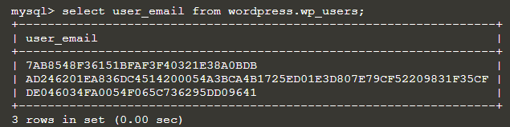
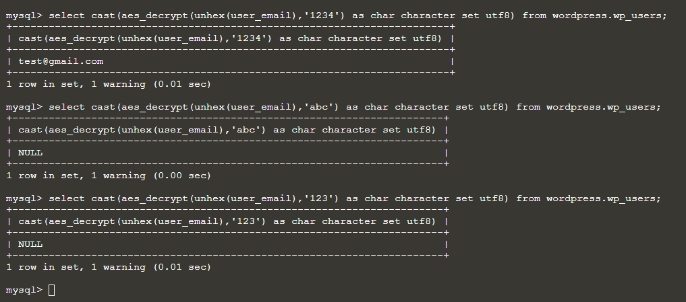

## Privilege Abuse (Continue)

## MySQL encryption
Besides access Control and Account Management in database,we could also encrypt data at rest by using the folling command:

`UPDATE wordpress.wp_users SET user_email=HEX(AES_ENCRYPT(user_email, '1234'));`{{execute}}

Sample result:

Without the right key, even if user have access to the senitive information, they still could not decrypt the data.

`select cast(AES_DECRYPT(unhex(user_email),'1234') AS CHAR CHARACTER set utf8) from wordpress.wp_users;`{{execute}}

`select cast(AES_DECRYPT(unhex(user_email),'abcd') AS CHAR CHARACTER set utf8) from wordpress.wp_users;`{{execute}}

`select cast(AES_DECRYPT(unhex(user_email),'5678') AS CHAR CHARACTER set utf8) from wordpress.wp_users;`{{execute}}

Sample result:
