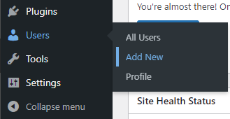
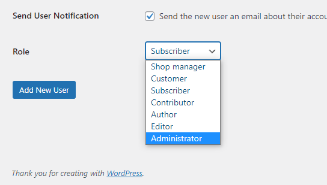
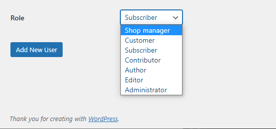
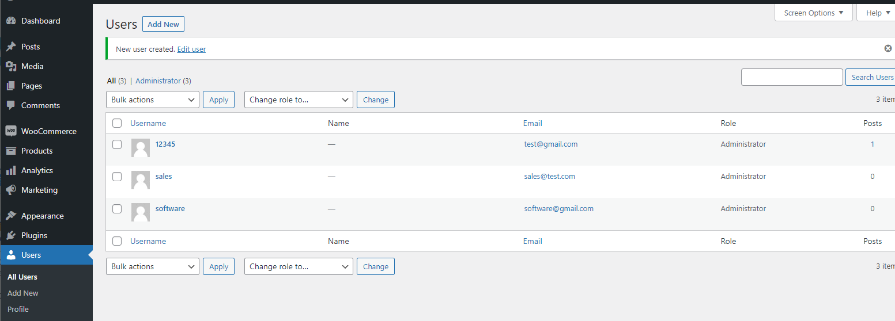
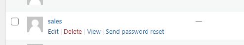

## Privilege Abuse (Continue)

## Wordpress Access control and Account management
On wordpress, different account role have different access right. To create different account for different team, navigate to the **User** section, **Add New**.

Different team should have different role. For example, the software developement team should have **Administrator** role for developing and maintaining the various wordpress customization.

On the other hand, the sales team should not have such access right. The sales team is responsible for maintaining product/pricing data and creating the marketing/promotion campaigns in the wordpress and WooCommerce platform. The **Shop Manager** role will allow the sale team to do that without granting them access to back-end functionality. 

It is easy to review the role assigned to an account in Wordpress. Navigate to the **Users** section:

To change the role of an user, click **Edit** and change it in **Role**, click **Update User** after changes. 

