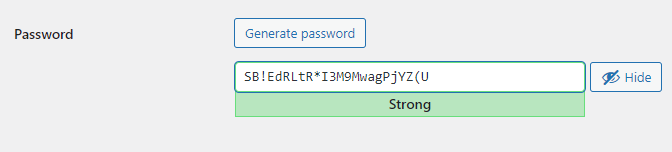
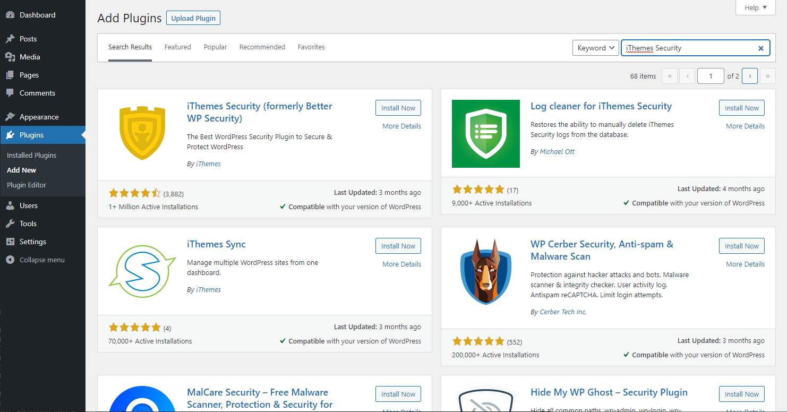
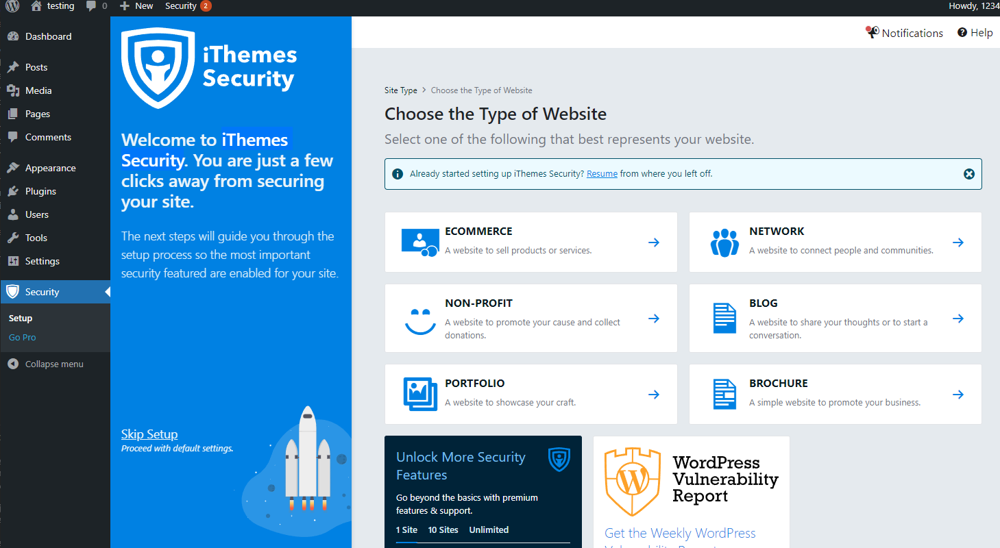
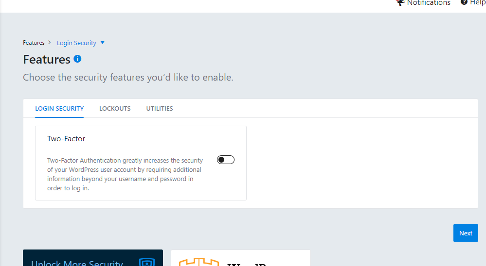
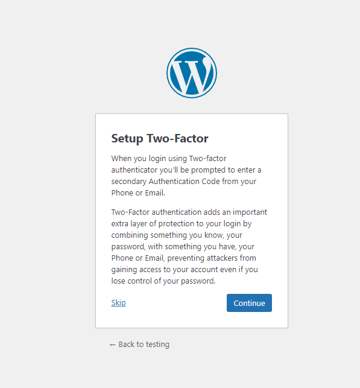
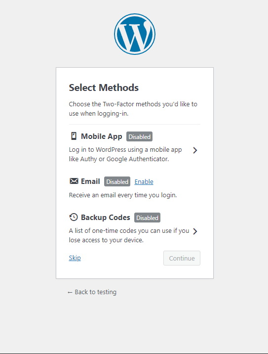

## Password Brute Force Attack

Your application could be attacked by hacker using password brute force attack. Hacker might try a list of commonly used password to bypass the authentication.

Some prevention method includes:
- Using strong password
- Two factor authentication

### Strong Password
Using a stronger password could avoid hacker successfully authenticate using commonly used password. Google suggest that a strong password should be:

- Unique (Use of special characters)
- At least 12 characters long
- Avoid personal info & common words/pattern

One way to create a strong password is by using Google chrome. Google chrome give password suggestions and help you manages your passwords with password manager.

Another way is to use the password generator provided by Wordpress.

## Two factor authentication
Two factor authentication(2FA) requires user to provide two authentication factor(common examples: email, SMS) to prove their identity. There are many plug-ins in Wordpress which could enable 2FA. Some examples include:

- iThemes Security
- Google Authenticator
- Wordfence

In this tutorial, we will use iThemes Security. To install iThemes Security, we search iThemes Security in the plugin section. Click **Install Now** and **Activate**:

In the Security section, setup iThemes Security(ECOMMERCE). 

In the **Features** section, enable **Two-Factor**.

When you lock out of your current session and login again, the site will require you to set up 2FA.

