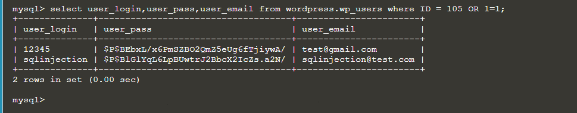
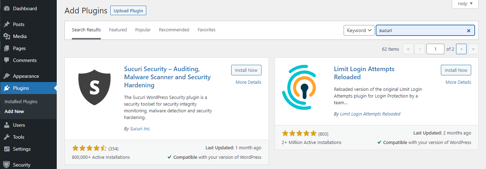

## Vulnerability exploits(XSS, SQL injection)
Hacker could exploits web vulnerability to do cross-site scripting(XSS) and SQL injection. For example, when we ask for a userID, a hacker could enter a OR statment such as **105 OR 1=1**. If there is no SQL injection prevention from stopping these inputs, a hacker could gain access to data in the database.

Sucuri(Wordpress plug-in) provide protection from XSS and SQL injection. To install Sucuri, we search Sucuri in the plugin section. Click **Install Now** and **Activate**::

To enable protection from XSS and SQL injection, in **Sucuri Security** > **Settings** > **Hardening**, click **Apply Hardening** ($9.99 USD/month).

By applying hardening, your website is less likely to be affected by vulnerability exploits.
