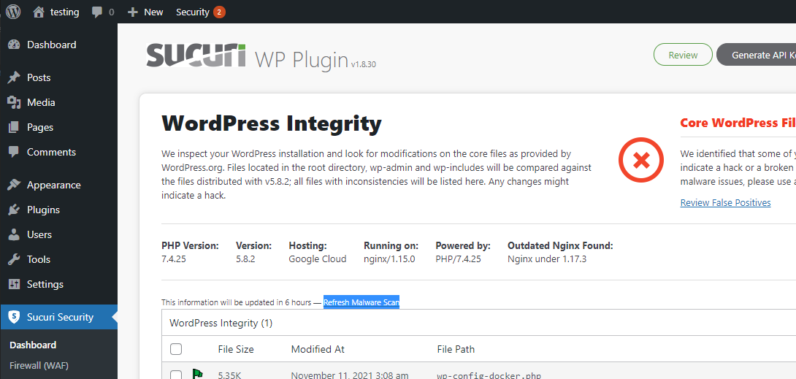
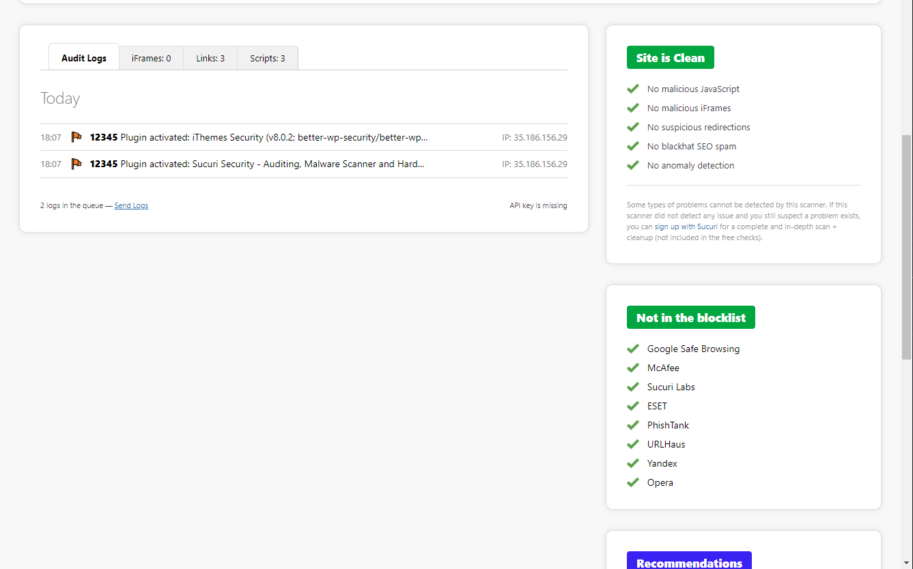

## Malware
Malware are code or file delievered over a network. It could cause damge by infecting, investigating or stealing. There are different types of Malware including:

- Trojans: Pretend as another software to trick people executing the software.
- Spyware: Attempt to steal PII
- Adware: Unwanted software that displays advertisments on your site
- Rootkits: Enable unauthorized users to gain access to your computer

(One of the largest data breach is caused by malware and up to 40,000 of records were compromised.)

Sucuri provide malware scanning. To pefrom malware scanning using Sucuri, go to **Sucuri Security** and click **Refresh Malware Scan**.

You could see if any problems were found in the **Dashboard**.

