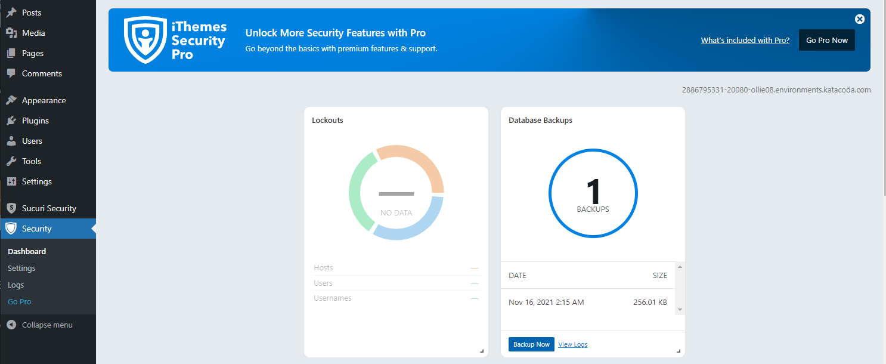
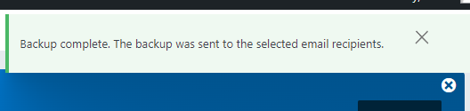
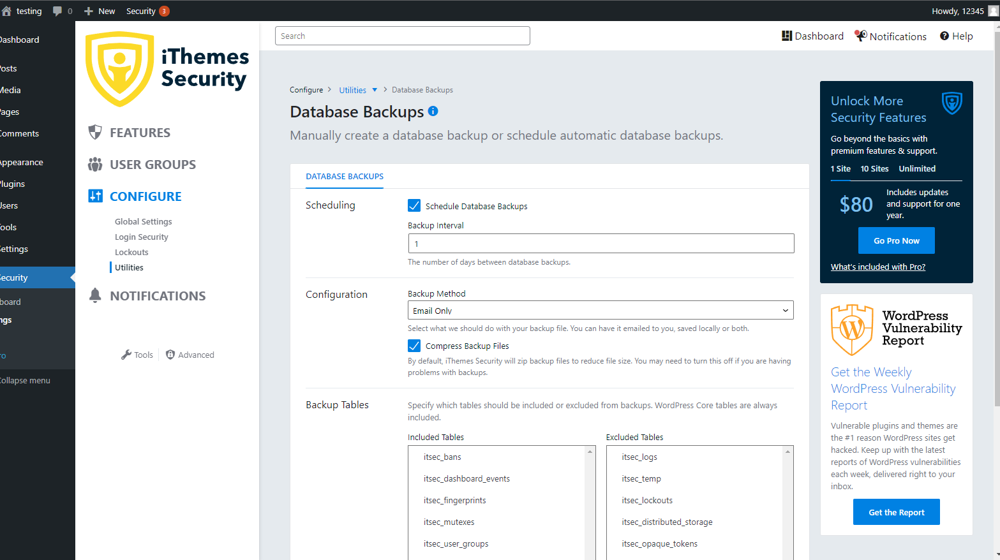

## Denial of service
Inadequate backup could cause permanent loss of data when facing denial of service(e.g. Botnets). Therefore, it is important to have regular backup. Using iThemes Security, we could backup the database.

Navigate to **Security**, in **Database Backups**, click **Backup Now**.

The backup will be sent to the email recipants.

You could also schedule database backups. Navigate to **Security** > **Settings** > **CONFIGURE** > **Utilities**, enable **Schedule Database Backups**.

It is recommended to follow the 3-2-1 Backup strategy.

- Three total copies
- Two On-site(e.g. Computer hard drive, external hard drive)
- One Off-site(e.g. Google Drive)

Two on-site copies provides quick access to your backups while off-site copies ensure your backup will be safe if anything happens to your physical location(theft/floods/fire).