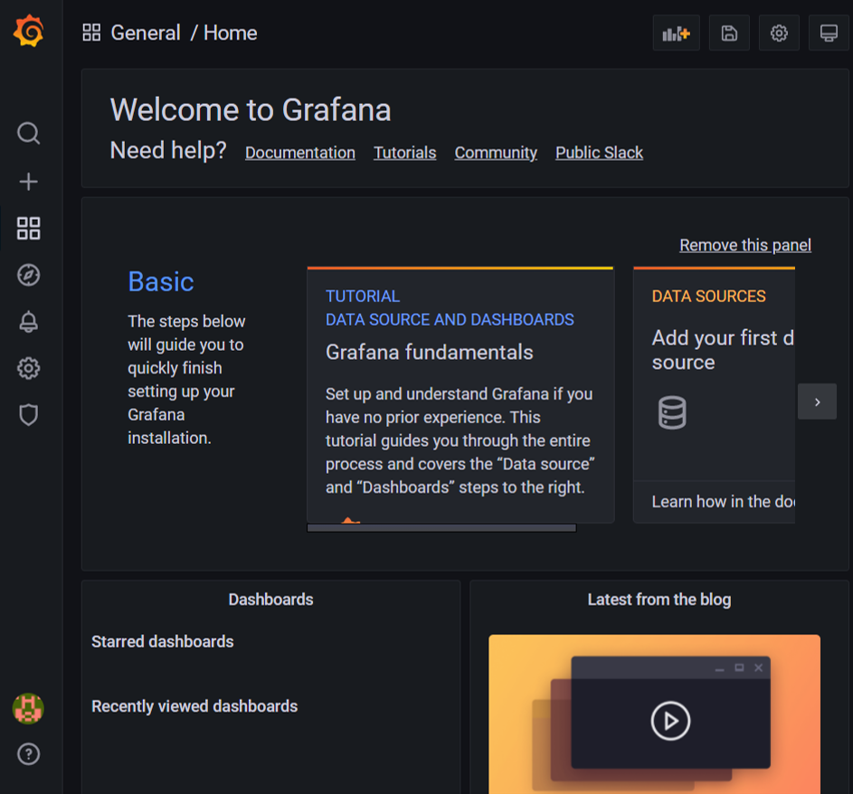
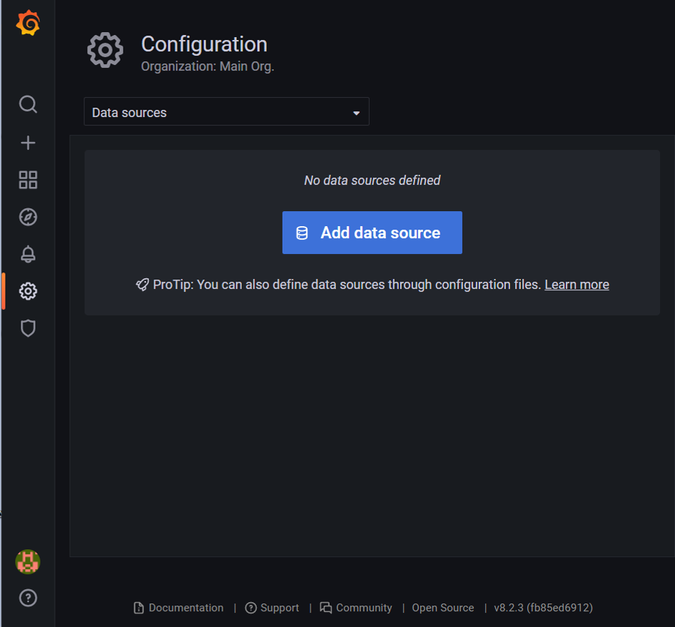
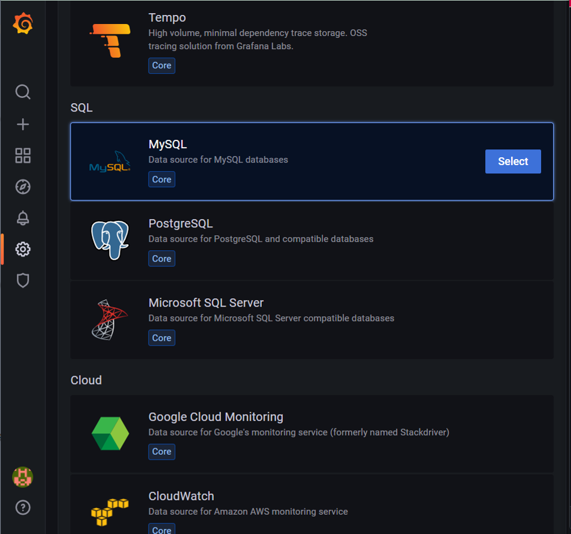
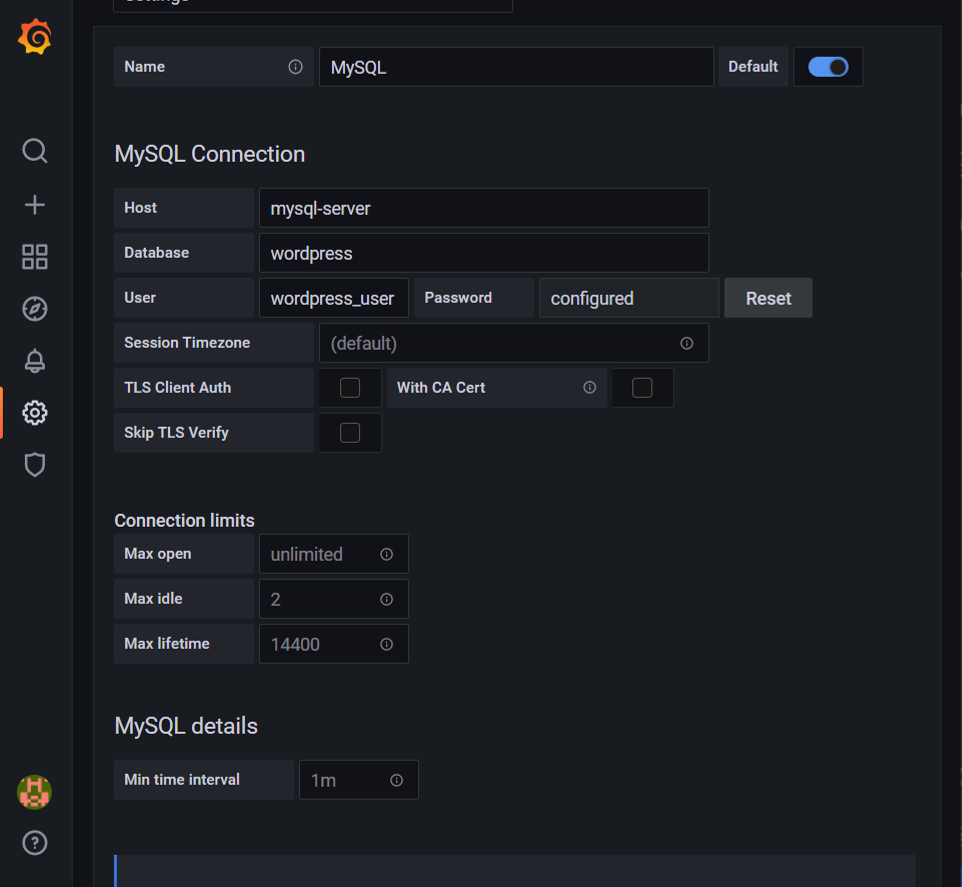

# Step 2: Set up Grafana
**1. Login to Grafana**
After start up the container, visit http://localhost:3000/login to login the grafana account.
As in the YAML we have set `'ADMIN'` as username and password. Then it will request you to assign new username and password. Then you can arrived the home page.

**2. Add data source**
As we need to connect our MySQL and WordPress with Grafana, we need to do the MySQL Connection in Settings.

Press `Add data source` to connect the database. 

Select `MySQL` to connect the database, it provided many data source like `Oracle`. 

Fill in the information as follow and press `Save & test`. All the information should be according to the YAML file, if no sql document is embedded. For instance, in `docker-compose.yml` the `MYSQL_DATABASE` have set as `wordpress`, the `MYSQL_USER` is `wordpress_user` and the `MYSQL_PASSWORD` is `secret`. 

After set up the MySQL connection, back to home page to edit the dashboard.
