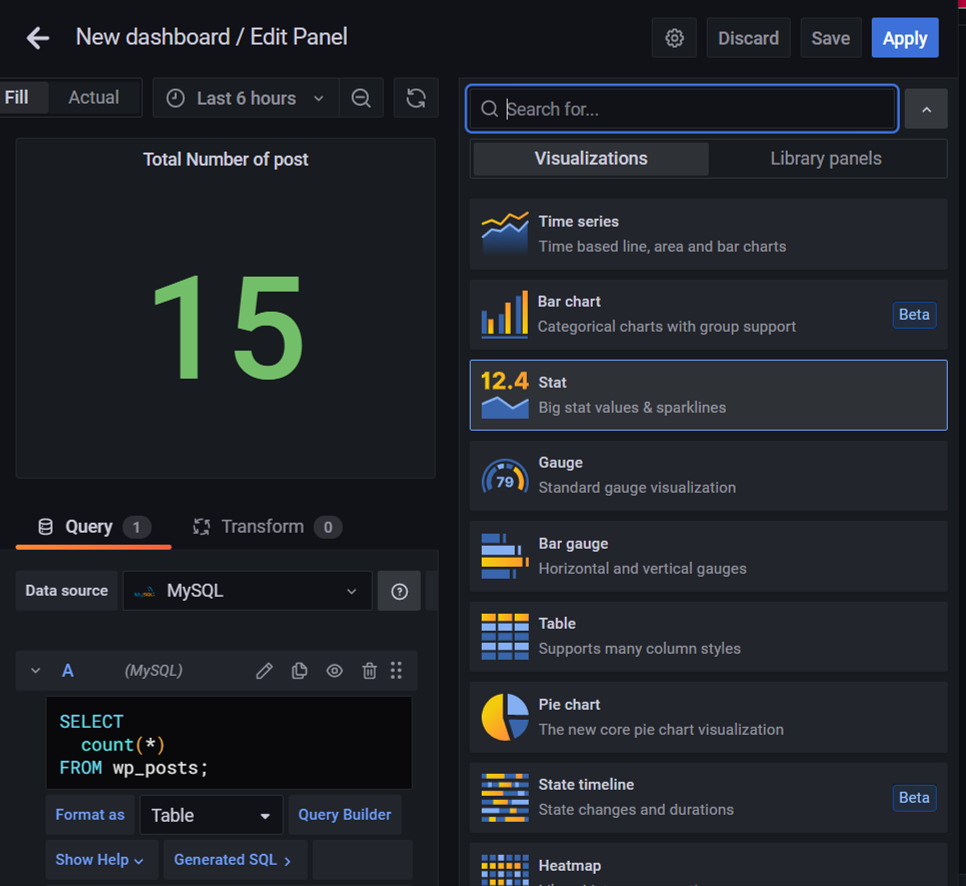
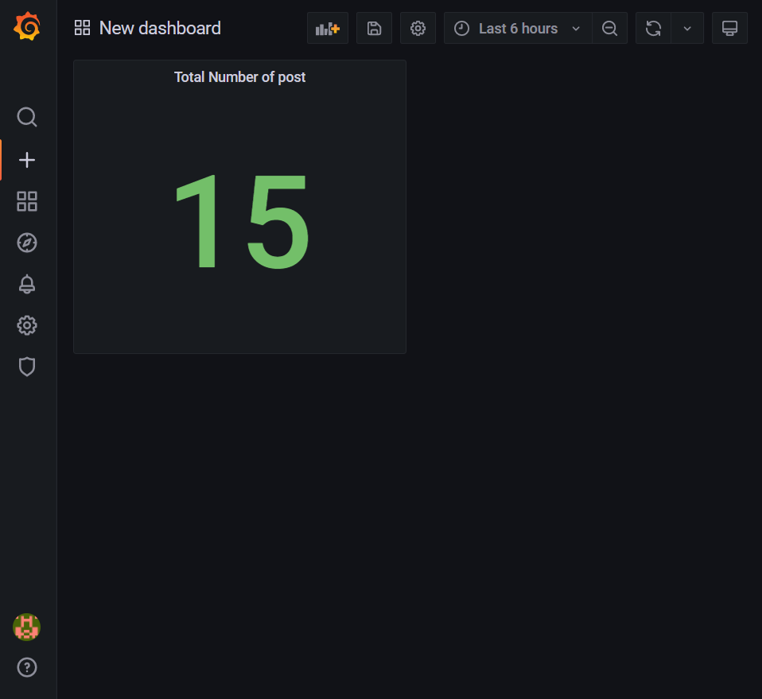

# Step 3: Set up the dashboard

### Grafana Dashboard
Click the new Dashboard link on the right side of the Dashboard picker. You now have a blank Dashboard.

The image above shows you the top header for a Dashboard.

1. Side menubar toggle: This toggles the side menu, allowing you to focus on the data presented in the dashboard. The side menu provides access to features unrelated to a Dashboard such as Users, Organizations, and Data Sources.
2. Dashboard dropdown: This dropdown shows you which Dashboard you are currently viewing, and allows you to easily switch to a new Dashboard. From here you can also create a new Dashboard or folder, import existing Dashboards, and manage Dashboard playlists.
3. Add Panel: Adds a new panel to the current Dashboard.
4. Star Dashboard: Star (or unstar) the current Dashboard. Starred Dashboards will show up on your own Home Dashboard by default, and are a convenient way to mark Dashboards that you’re interested in.
5. Share Dashboard: Share the current dashboard by creating a link or create a static Snapshot of it. Make sure the Dashboard is saved before sharing.
6. Save dashboard: The current Dashboard will be saved with the current Dashboard name.
7. Settings: Manage Dashboard settings and features such as Templating and Annotations.

A Grafana dashboard supports multiple panels in a single grid. You can visualize results from multiple data sources simultaneously. It is a powerful open-source analytical and visualization tool that consists of multiple individual panels arranged in a grid.
You can set up the dashboard by creating different data analysis or import usful dashboard template from https://grafana.com/grafana/dashboards.

1. Select `Add Panel` to create new panel
2. In the right hand side can choose the presentation format like barchart, statistic...
3. In the top left hand side can preview the result
4. In the bottom of the left hand side can edit the sql command which would like to shown

In the example below, it have shown the total number of post. So, if any new po released can be monitor here directly with others data. Not only the total number of posts, the user activity can be monitor here by create panel generate log informations. Therefore, if there are any invaild users existed can be spot immediately.

At last, press `Apply` to put it in the dashboard.

