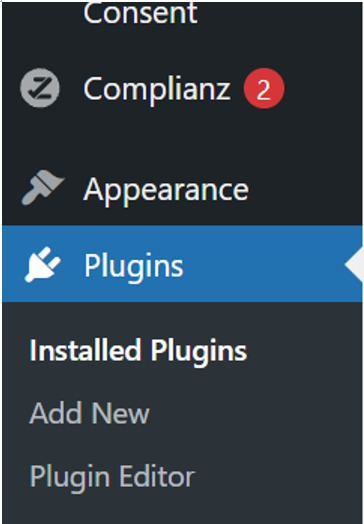
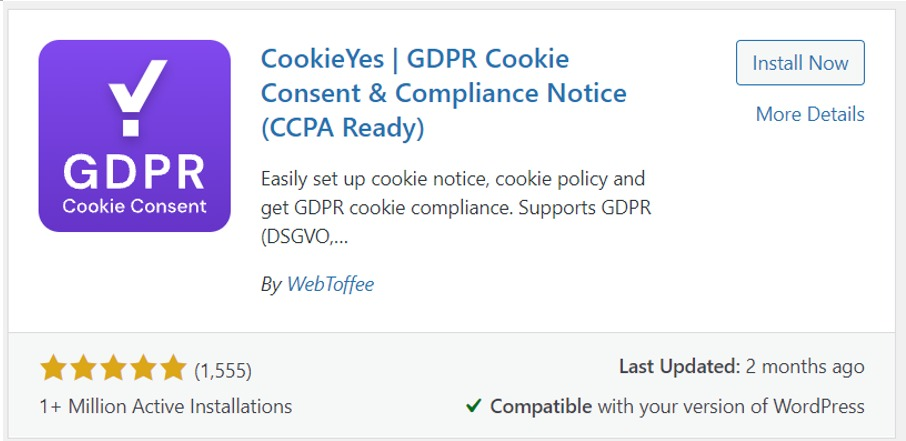
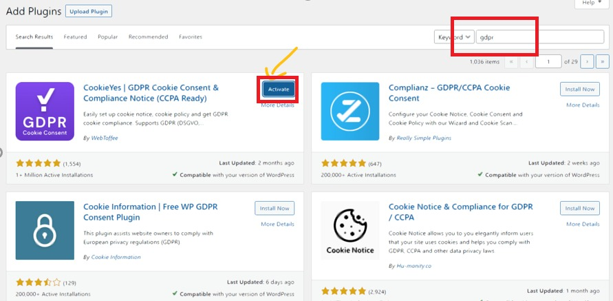
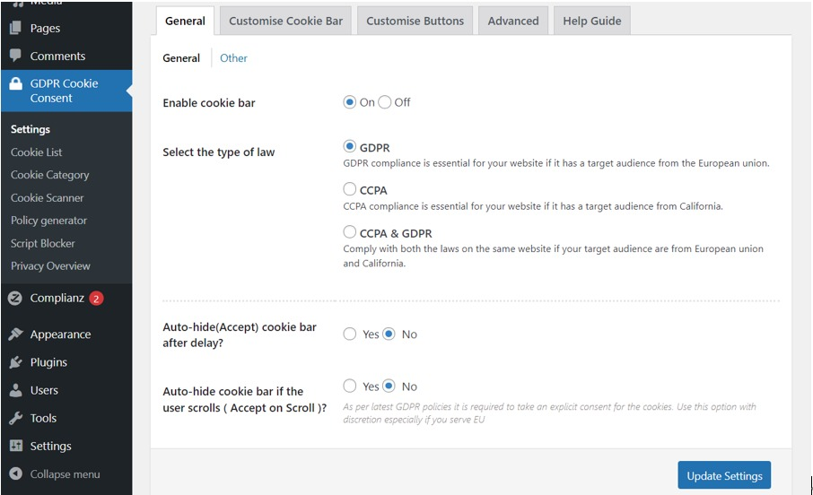
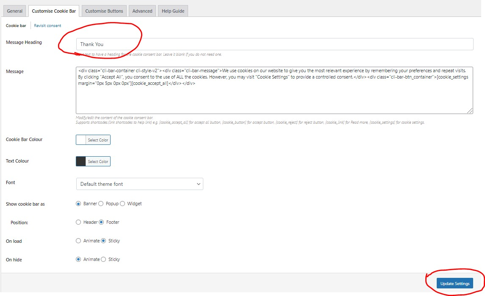
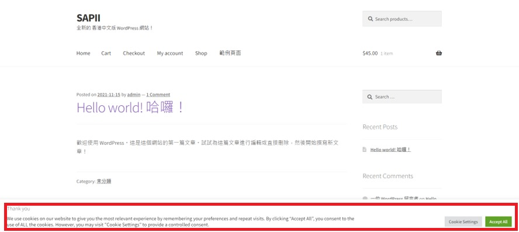
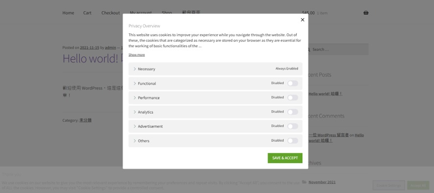

## GDPR plugin installation tutorial

It is a software for user to install the GDPR and it called CookiesYes.

First, we go to Plugins and press Add New.

Second, we install GDPR CookiesYes by search GDPR.

Next, after we installed the CookiesYes, we press activated. 

Next, we go to GPPR Cookies Consent. In the general page, we could see enable cookies bar, etc. We press update setting.

In the customise cookie bar, we could see lots of functions, and we can edit the message heading like "Thank You" and then click update setting.

After that, we click the home page to see the output which is the information and details on the home page. Under the page, it is the cookies and we can see Thank You on the cookies.

With the cookies setting, we could see some details on privacy overview on the cookies. 

