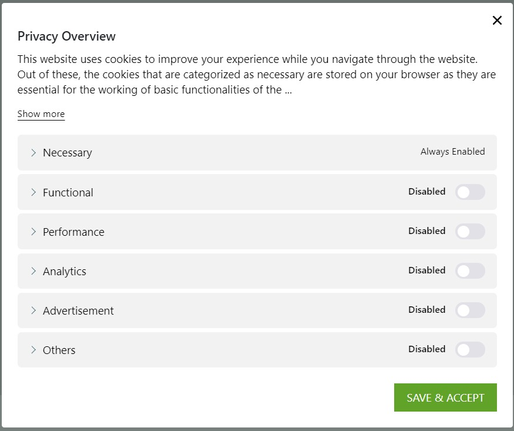

# The right of the GDPR

## The right of access

The provision of right of access means that controllers are required to provide data subjects, i.e., natural persons whose personal information is being collected, a copy of their processed personal data upon request. The information is to be provided in writing, or by other means, where appropriate, by electronic means. Further, the information, when requested by the data subjects may be provided orally, provided that the identity of the data subject is proven by other means.

## The right of rectification

Individuals have the right to have personal data rectified. You can rectify personal data if it is inaccurate or incomplete. You must rectify any inaccurate personal data that relates to the individual without undue delay, and in any event within one month.

## The right to erasure 

It is known as the ‘Right to be Forgotten’, is a new right being introduced to individuals under the GDPR. The underlying principle of this right is that when there is no compelling reason for their data to be processed.

### The data subject can:

* Request the data controller erase/remove their personal data.
* Stop any further distribution of their personal data.
* Potentially stop third parties from processing their personal data.

## The right to restrict processing 

It is mean that an individual can limit the way that an organisation uses their data. This is an alternative to requesting the erasure of their data. Individuals have the right to restrict the processing of their personal data where they have a particular reason for wanting the restriction.

## The right to portability 

The right to data portability allows individuals to obtain and reuse their personal data for their own purposes across different services. It allows them to move, copy or transfer personal data easily from one IT environment to another in a safe and secure way, without affecting its usability.

## The right to object

Individuals have the absolute right to object to the processing of their personal data if it is for direct marketing purposes. Individuals can also object if the processing is for: a task carried out in the public interest; the exercise of official authority vested in you

## Consent management

The customers have the right to choose which of the cookies the website is able to store. In this figure, I have turn off or disable all of the features. Therefore, the website cannot save my record or information on these features.

