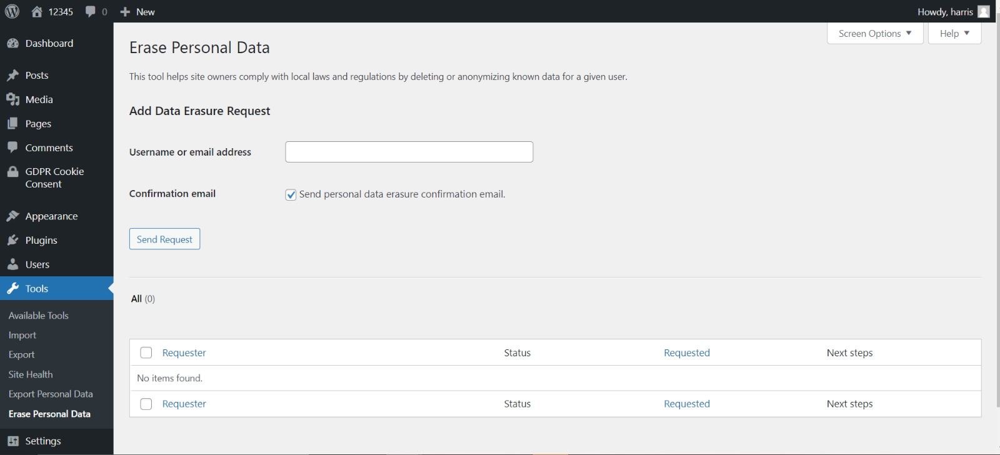

# The function of Wordpress to meet GDPR requirement

Go to the setting, and press privacy, it would show you the privacy setting in this page. If your website does not have privacy policy page, you can create one by using this wordpress function. 

Go to the tool, and press erase personal data, it would show you the page of erase personal data. The visitors or customers can required admin to remove the personal data by using this wordpress features.

Go to the tool, and press export personal data, it would show you the page of export personal data. The visitors or customers can required admin to export the personal data to take their information by using this wordpress features.

Go to the setting, and press discussion, it would show you the page of discussion. It can show comments cookies opt-in checkbox. allowing comment author cookies to be set

