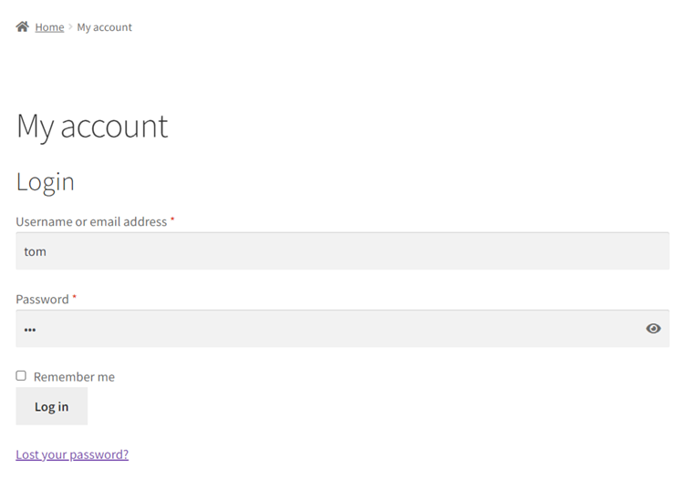
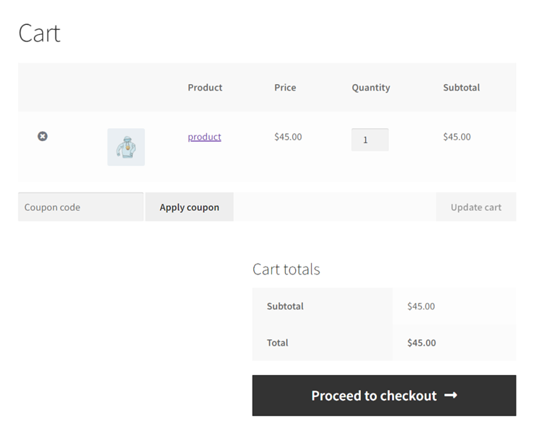
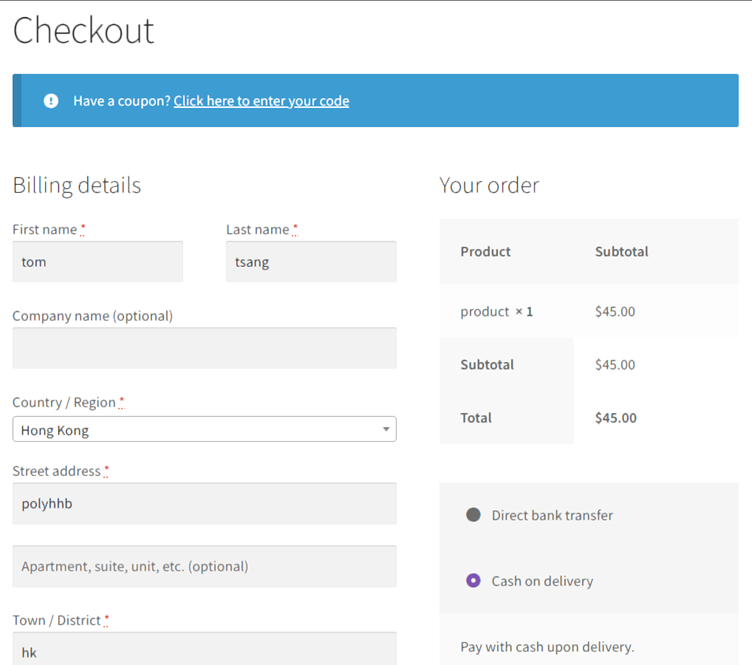
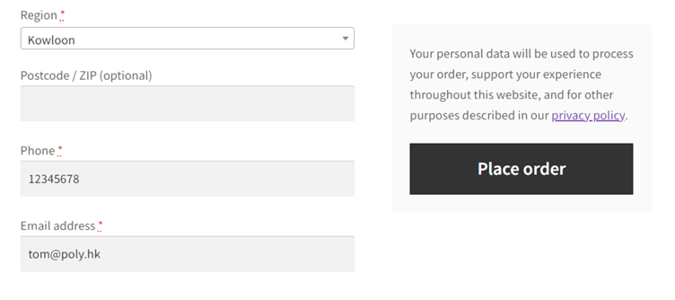
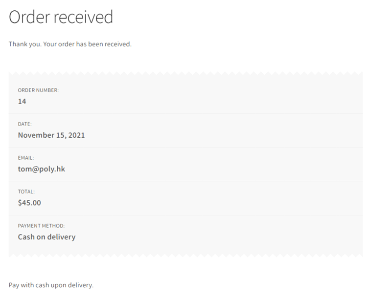

## Shopping in the store using the customer account ##

**Suppose you have finished all the steps in the 'WordPress Setup' scenario (including setting up WordPress, WooCommerce, creating a sample products, payment methods and a sample customer),**

**We can now try to shop in the store using the customer account we created before.**

1. Log in as a customer

To login and simulate a customer, visit: 

https://[[HOST_SUBDOMAIN]]-20080-[[KATACODA_HOST]].environments.katacoda.com/my-account/

Logout the admin account and login with the customer account you just created.

2. Add the product to cart

After logging in as a customer, go to 'Shop' and add the sample product into the cart.

3. Proceed to Checkout

Make up some random data and type into the Billing details section, choose Cash on delivery as payment method and Place order. 

4. Order will be received:
