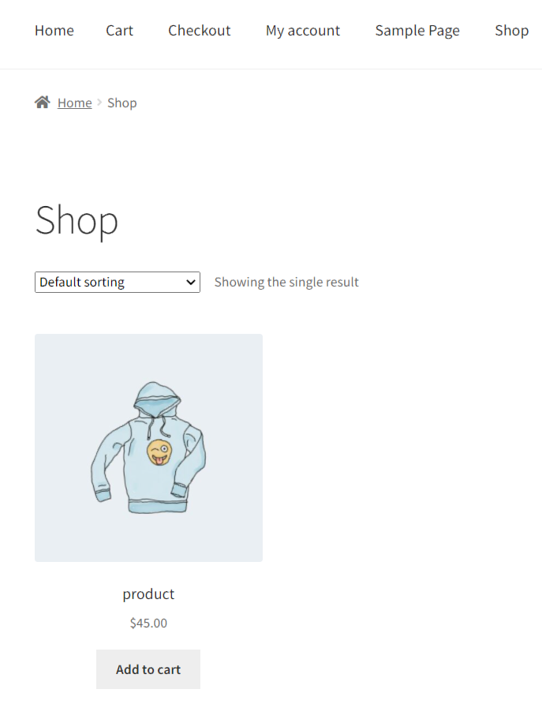
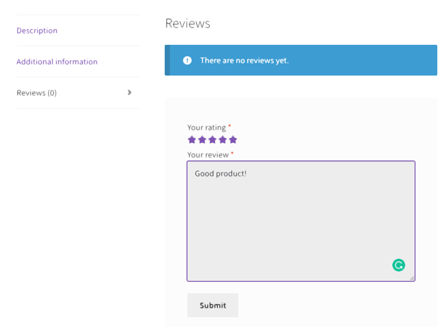
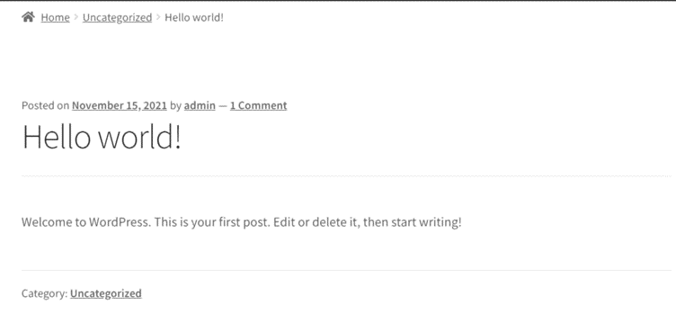
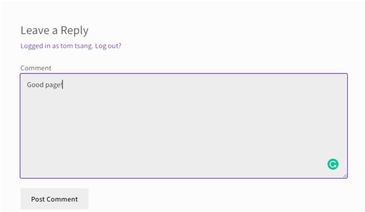

## Give a review for the product and leave a comment for post ##

*Supposed you are logged in as a customer.*

We can now try to give a review for the sample product created and leave a comment for the sample post.

1. Give a review for the product

Going to 'Shop', select the product and scroll down to find the review section. 

Give a review and then submit it.

2. Leave a comment for the sample post

Go to 'Home' and clicked on the 'Hello world!' post.

Click on 'Comment' to leave and post a comment for the post.
