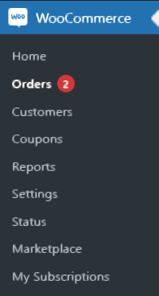
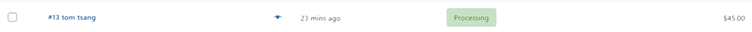
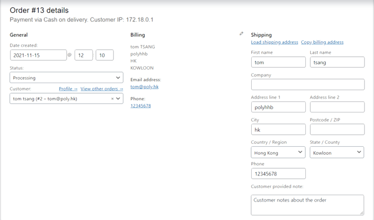

## Find out where is your sensitive data stored[WooCommerce]

In this step, we will try to discover the sensitive data stored in the WooCommerce platform. 

You are supposed to log in to the Wordpress dashboard with admin account.

1. Navigate to the 'Order' section of the 'WooCommerce' platform

2. Check the order

As we can see, sensitive data like:

### • Name
### • Billing Address
### • Telephone number
### • Email address
### • IP address

are stored and can be displayed in this way.

These data are created and stored when we **Checkout and Make an order** previously.