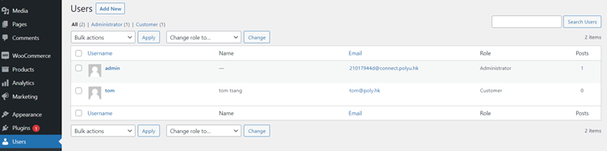
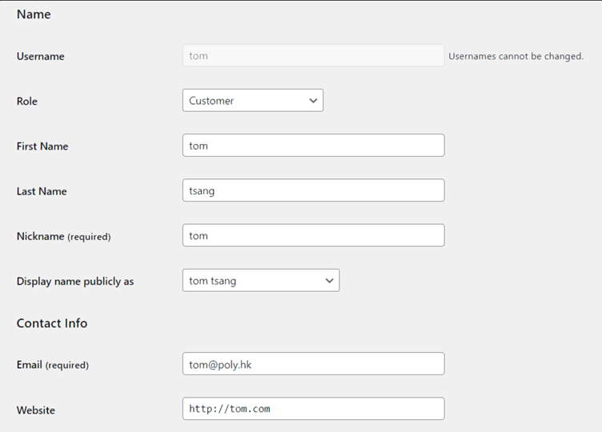
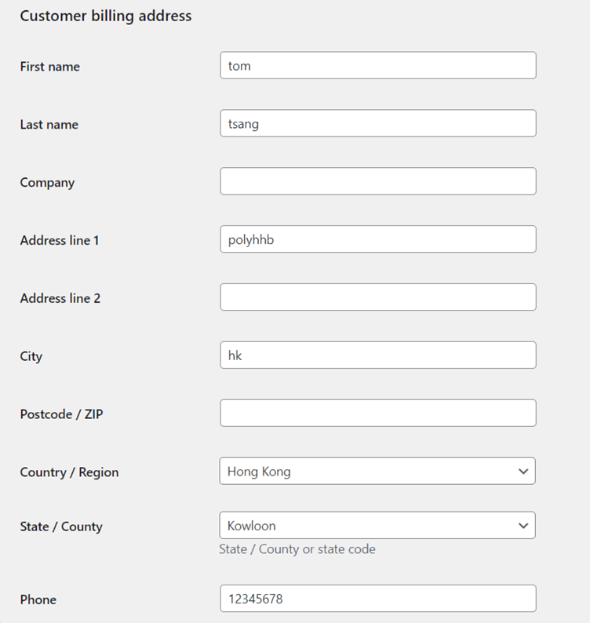

## Find out where is your sensitive data stored[WordPress]

In this step, we will try to discover the sensitive data stored in the WordPress platform. 

You are supposed to log in to the Wordpress dashboard with admin account.

1. Navigate to the 'User' section of the 'WooCommerce' platform

2. Select the customer user

As we can see, sensitive data like:

### • Name
### • Billing Address
### • Telephone number
### • Email address
### • IP address
### • User url

are stored and can be displayed in this way.

These data are created and stored when we **Create the sample user and fill in the shipping and billing address** previously.