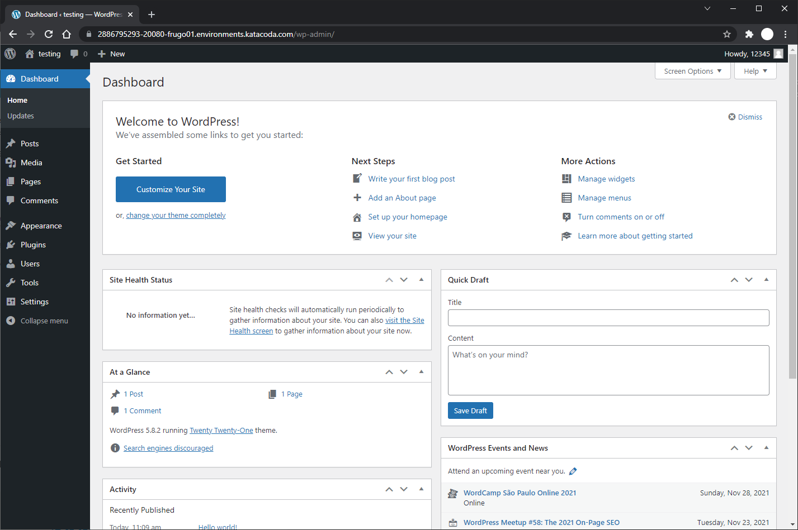
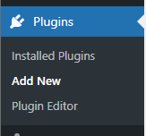
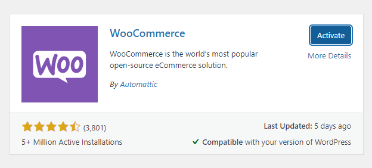

## Install Woocommerce plugin

Now that you have set up and log-in to your Wordpress application, you should be able to see the Wordpress Dashboard:

To install Woocommerce plugin, navigate to the Plugins section:

Add new plugin:

Install and activate Woocommerce:

