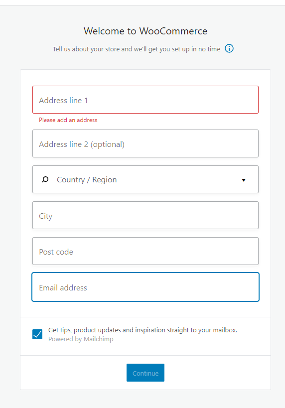
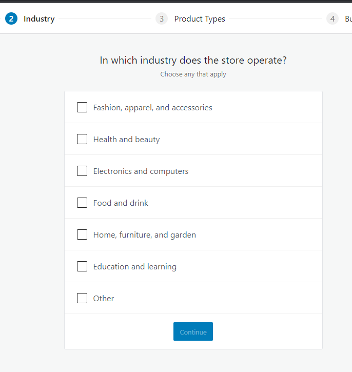
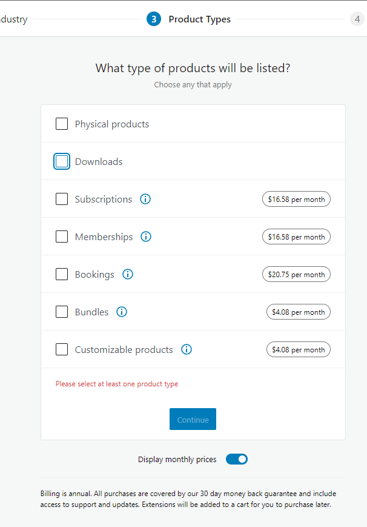
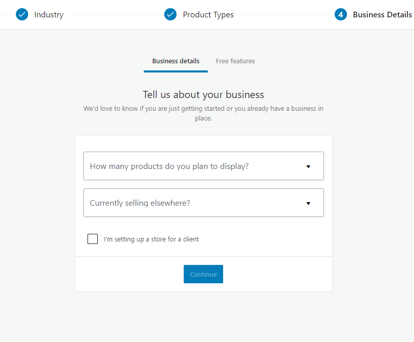
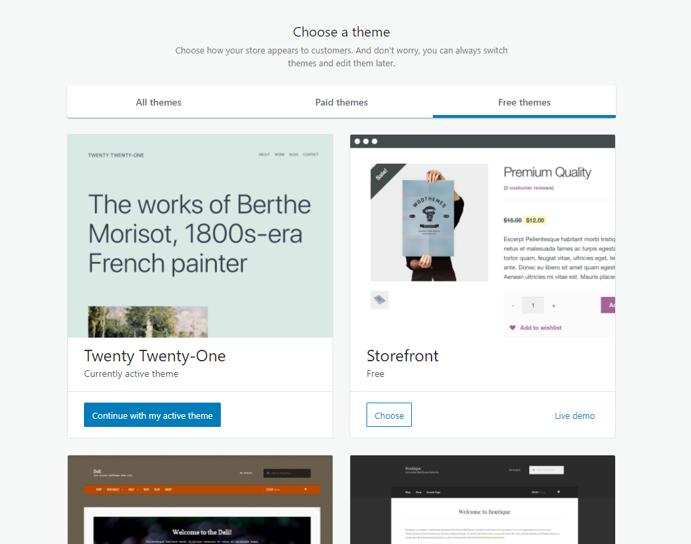
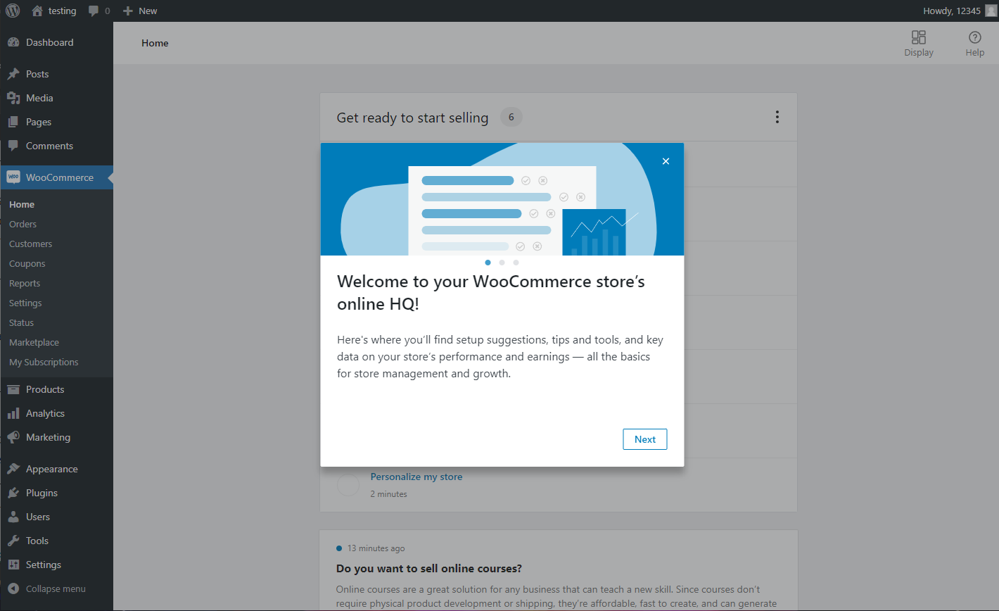

## Setup Woocommerce

After you activate Woocommerce, setup wizard will prompt up. Setup your sample store by following the instructions.

### Untick **Add recommended business features to my site** and click **Continue**, these could be added later on.

### Choose any theme you like

### Woocommerce has been set up successfully

