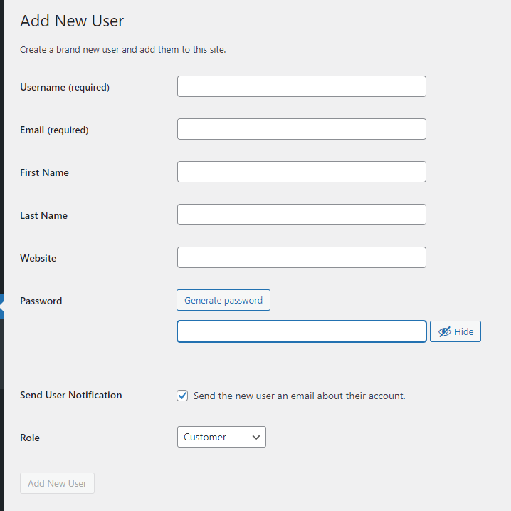

## Customer/transaction data and user accounts(Continue)

To create a sample customer:

In Role, select **Customer**

Click **Add New User** when you are done.

##Simulating a customer

To login and simulate a customer, visit: 

https://[[HOST_SUBDOMAIN]]-20080-[[KATACODA_HOST]].environments.katacoda.com/my-account/

Logout the admin account and login with the customer account you just created.